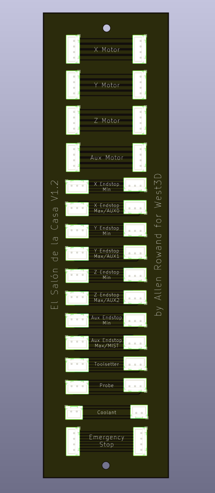

Files and documentation for the Salon board for Casa

# Why?
We wanted to provide a simple and inexpensive way to connect your Milo to the electronics bay of your Casa while allowing you to easily remove the Milo for service. The Salon PCB provides a "patchbay" to interconnect your MCU and the mill.

# How?
You can purchase the Salon board and/or wiring bundles at West3D here: https://west3d.com/PLACEHOLDER_URL You're also welcome to produce your own PCB with our [KiCad files](kicad). The wiring is a simple 1:1 between the electronics bay and mill.

[STLs](stls) for a printed PCB mount are in this repo.

# Setup
Hardware you'll need:
| Fastener  | Quantity |
| ------------- | ------------- |
| M3x6 screw  | 2  |
| M3x8 screw  | 4  |
| M5x8 screw  | 4  |
| M3 heatset  | 6  |
| M5 roll-in nut  | 4  |

- Print the PCB mount.
- Insert two "Voron standard" M3 heat inserts in the back of the mount to hold the PCB, as well as two in the top and another two in the lower legs to hold the front of the case.
- The PCB is held in place with two M3x6 screws.

- After installing the PCB, attach the back of the mount to the rear upright in the Casa with four M5x8 screws and roll-in nuts.
- Connect the wiring from the electronics bay to the PCB, then connect the wiring from the mill. There's no defined in or out sides, all connections are are parallel.
- Once everything is patched install the front cover with four M3x8 screws to help keep chips away from the connections.

# What about all these other connections, like Aux?
We wanted to bring all the available ports of the Scylla board into the work area for whatever additional hardware you want to control. Caselights, air, coolant, disco balls…

# Why "Salon"?
The Casa is the "house" for the Milo- the central room in a casa is often called the salon.

